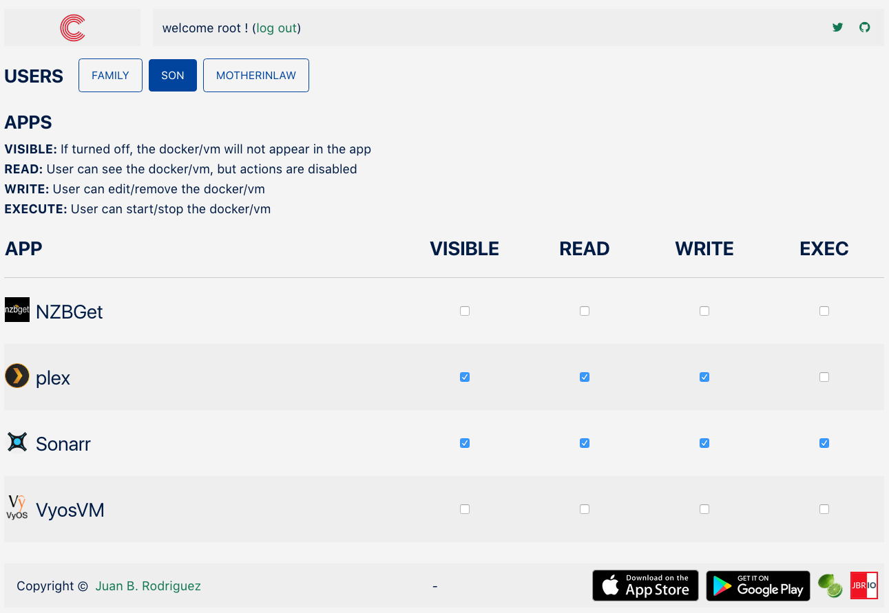

ControlR
=========

*tl;dr* **ControlR** is a companion plugin for the [ControlR app](https://www.apertoire.com/controlr/).

## Screenshot

## Introduction
This plugin allows you to set up user permissions for the ControlR app.

 Operation is simple
- Add a user in the unRAID webGUI

- Select that user in the plugin

- Define permissions for the user

 The following are the allowed permissions:

**VISIBLE:** If turned off, the docker/vm will not appear in the app

**READ:** User can see the docker/vm, but actions are disabled

**WRITE:** User can edit/remove the docker/vm

**EXECUTE:** User can start/stop the docker/vm

## Installation
There are 2 ways to install this application

- Community Applications 
Go to the Apps tab 
Click on the Plugins button 
Look for ControlR 
Click Install

- Plugins Tab (manual) 
Go to the Plugins tab 
Click on Install Plugin 
Paste the following address in the input field: https://raw.githubusercontent.com/jbrodriguez/unraid/master/plugins/controlr.plg 
Click Install

## Running the app
After installing the plugin, you can access the web UI, via the following methods:

- Method 1 
Go to Settings > Utilities 
Click on ControlR 
Click on Open Web UI 

- Method 2 
Go to Plugins > Installed Plugins 
Click on ControlR 
Click on Open Web UI 

- Method 3 
Navigate with your browser to http://Tower:2378/ (replace Tower with the address/name of your unRAID server) 

## Credits
- [Go](https://golang.org/) - Back End
- [echo](https://github.com/labstack/echo) - REST and websocket api
- [pubsub](https://github.com/tuxychandru/pubsub/) (slightly modified)
- [React](https://facebook.github.io/react/) - Front End
- [mobx](https://github.com/mobxjs/mobx) - Simple, scalable state management
- [tachyons-sass](https://github.com/tachyons-css/tachyons-sass) - Transpiled Sass partials for Tachyons
- [flexboxgrid](http://flexboxgrid.com/) - CSS3 flex based grid system framework
- [Webpack](https://webpack.github.io/) - Build toolchain

## License
[MIT license](http://jbrodriguez.mit-license.org)
